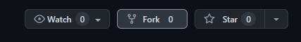

# How to start with MjolNear?

### Which contracts are supported on MjolNear?

Not every contract on NEAR blockchain is NFT contract. There are several standarts that must be implemented by the contract: [NEP-171](https://nomicon.io/Standards/NonFungibleToken/Core), [NEP-177](https://nomicon.io/Standards/NonFungibleToken/Metadata), [NEP-178](https://nomicon.io/Standards/NonFungibleToken/ApprovalManagement) and  [NEP-181](https://nomicon.io/Standards/NonFungibleToken/Enumeration). If contract implements all this standarts, it will become usable and visible on MjolNear and any NFT from this contract can be sold or bought via MjolNear.

### What if I want to create my own NFT contract?

It seems a bit complex on the first look but MjolNear team will provide a complex exmaple on how to create your own NFT contract that will satisfy all the requirements, described in previous section.

1. Go to our [sample repository](https://github.com/MjolNear/simple-nft-contract) on GitHub and fork it using "Fork" button in the top right corner.



2\. Clone forked repository.

3\. Now go to directory with cloned project and run in terminal: `./build.sh` . It will build the contract.

4\. Now we have to deploy the contract, initialize it and mint the first NFT. Write these commands in terminal:

1. `export NEAR_ENV=mainnet`
2. `near login`- use it to login via your NEAR account
3. `near create-account *your NFT contract name with suffix as masterAccount* --masterAccount *you account name* --initialBalance 6.0`. Alternatively you can deploy this contract to any other account but be sure that there is enough NEAR for initial storage coverage,
4. `near deploy --accountId example-contract.testnet --wasmFile out/main.wasm --initFunction new --initArgs '{"owner_id": "*you account name*", "metadata": {"spec": "nft-1.0.0", "name": "*name of your NFT contract*", "symbol": "*symbol of your contract, usually a small word*", "icon": "*URL for icon of your contract*", "base_uri": "*base URI for decentralazed storage of contract additional metadata (for example` [`NFT Storage`](https://nft.storage)`)*", "reference": "*URL to JSON with more info (traits and etc.)*", "reference_hash": "*hash of reference from previous field. It will be used to build link using base_uri*"}}'`- this command will initialize your contract. You must supply the owner\_id in arguments (owner is the only person who can mint NFTs on the contract, usually it is just your account) and metadata (some info about your NFT contract). NOTE: it may require about 6.0 NEAR for initial storage of the contract. Funds will be drawn from account passed in `--masterAccount`. &#x20;
   * &#x20;Arguments example:    &#x20;
   * ```
     { "owner_id": "myaccount.near", 
       "metadata": { 
           "spec": "nft-1.0.0", 
           "name": "My First NFT collection!", 
           "icon": "https://cdn-icons-png.flaticon.com/512/1818/1818401.png", 
           "base_uri": "https://ipfs.io/ipfs", 
           "reference": "https://linktojson.com/myjson.json", 
           "reference_hash": "aSBsb3ZlIG1qb2xuZWFyIHZlcnkgdmVyeSB2ZXJ5IG11Y2ghISE=" 
         }
       }
     ```
5. You contract is ready! Now you can mint any token on it using this command:
   * `near call *your contract name* nft`_`mint '{"tokenid": "*unique id of this token*", "token_`_`owner`_`id": "*owner of this token. May be you want to mint it directly to your friend!*", "token_`_`metadata": *some token metadata*}' --depost 0.1 --gas 300000000000000`
   * Token metadata must be json with such format:
     *

         ```
         { 
           "title": "My lovely Punk.", 
           "description": "I really love my punk.", 
           "media": "https://ipfs.io/ipfs/bafybeicmy2c2hpfb5so5maacqnfuxm54ohom5iaeaeeuhvrxg6j32hn6re/avatars-rfwy5mSeUytFz5Gx-8s06ZQ-t240x240.jpg", 
           "media_hash": "bafybeicmy2c2hpfb5so5maacqnfuxm54ohom5iaeaeeuhvrxg6j32hn6re", 
           "copies": 1, 
           "issued_at": ..., // ISO 8601 datetime when token was issued or minted
           "expires_at": ..., // ISO 8601 datetime when token expires
           "starts_at": ..., // ISO 8601 datetime when token starts being valid
           "updated_at": ..., // ISO 8601 datetime when token was last updated
           "extra": {"traits": {"eyes": "blue"}}, // anything extra the NFT wants to store on-chain (like traits and etc.). Can be stringified JSON.
           "reference": "https://myjsonwithtraits.com/punk.json", // URL to an off-chain JSON file with more info.
           "reference_hash": "cHVuayBmb3IgbWpvbG5lYXIhIG1vbSBpIGxvdmUgeW91", // Base64-encoded sha256 hash of JSON from reference field. Required if `reference` is included.
          }  
         ```
6. You are all set! Now you have you NFT on your contract! Now you can go to MjolNear and place it one the market.


